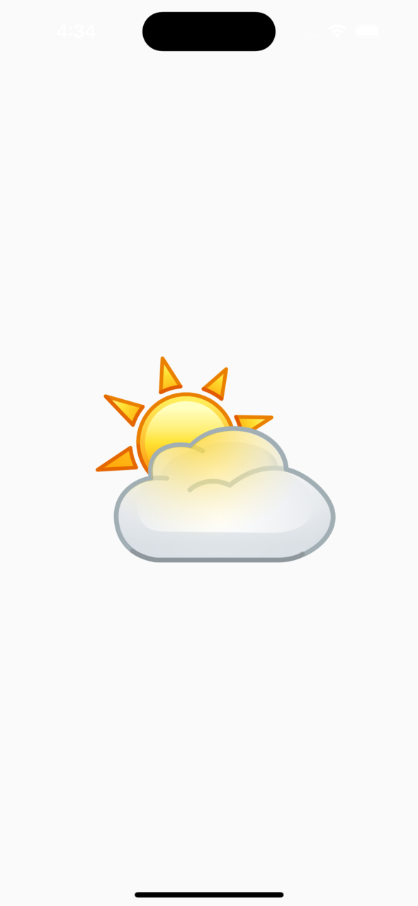
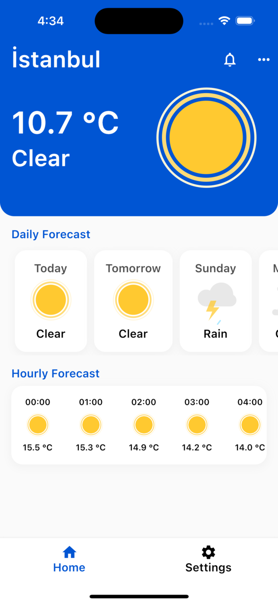
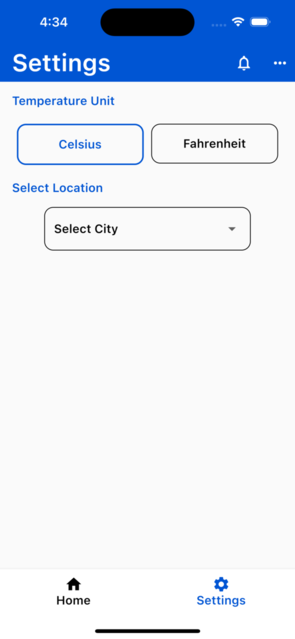

## WeatherApp

Weather app is a mobile application developed using Flutter. This application allows the user to view and follow the weather conditions in his/her location and the location he/she chooses.


## App Screenshots

 



  
## Features

- View the weather conditions in your current location
- View the weather in the selected location
- Displaying the 7-day weather forecast at the selected or current location
- Displaying hourly weather conditions in the selected or current location

  
## Technologies Used

**State Management:** Provider 

**Routing:** AutoRoute

**Assets Management:** Flutter Gen

**Network Requests Manager:** Dio

**Architecture Pattern:** MVVM (Model-View-ViewModel)

## Installation

1. Clone this project:

```bash
git clone https://github.com/Mehmettmolla/weather_app.git
```
2. Navigate to the project directory:
```bash
cd weather_app
```
3.Install the required dependencies:
```bash
flutter pub get
```
4.Run the application:
```bash
flutter run
```

## Contributing
1. Fork this repository and create a local copy.
2. Create a new feature branch:
```bash
git checkout -b new-feature
```
3.Commit your changes:
```bash
git checkout -b new-feature
```
4.Push your branch:
```bash
git push origin new-feature
```
Open a Pull Request

## License
This project is licensed under the MIT License. See the LICENSE file for more information.